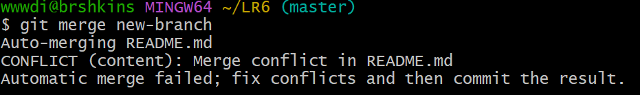

# Лабораторная работа 6
## Система контроля версий

### Выполнила: [4416] [Гудкина Д.Г.]

### Цель работы: оизучение базовых возможностей системы управления версиями, опыт работы с Git Api, опыт работы с локальным и удаленным репозиторием. 

### Ход работы:

#### 1. Аккаунт

#### 2. Настройки гит

#### 3. Изменения и откат

#### 4. Конфликт

#### 5. Новая ветка

#### 6. Логи

### Вывод

#### Изучила базовые возможности системы управления версиями
